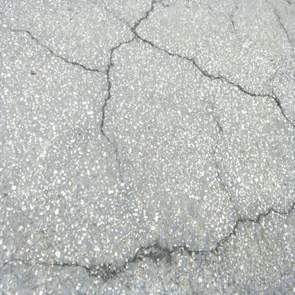
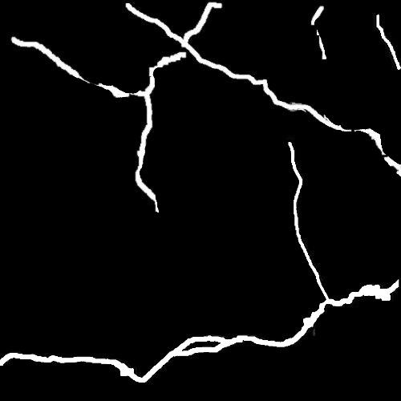
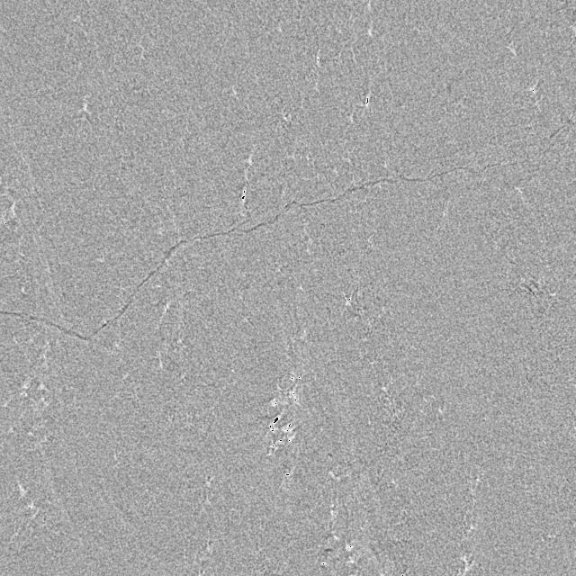

# Overview
It is a good method to identify cracks on roads, buildings and other civil structures by using deep learning, especially the semantic segmentation technology of computer vision. 

But the establishment of data set is the first step of the whole work. In order to accomplish this task, the semantic segmentation dataset of rock crack and CT rock slice crack is established.

# How to download 

## for rock-crack and concrete-crack

[rock-crack and concrete-crack dataset](http://47.94.192.51/static/files/images.tar.gz)

```bash
wget http://47.94.192.51/static/files/images.tar.gz
```

## for CT-slice-crack 


[CT-slice-crack  dataset](http://47.94.192.51/static/files/CT_images.tar.gz)

```bash
wget http://47.94.192.51/static/files/CT_images.tar.gz
```

# Example

## rock crack


## concrete crack



## CT-slice crack




# dataset-kit

├── dataset-kit

│   ├── `amplifyData-16.py`  (for data enhancement)

│   ├── `amplifyData.py`   (for data enhancement)

│   └── `calc-mean.py`    (for data preprocess)


# Thanks

Thanks to ZhangLiao（张辽） and WangAo（王傲） for their help.

# TODO

There is a problem with [amplifyData-16.py](dataset-kit/amplifyData-16.py). I need time to refactor it.